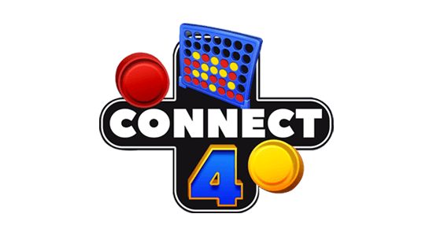
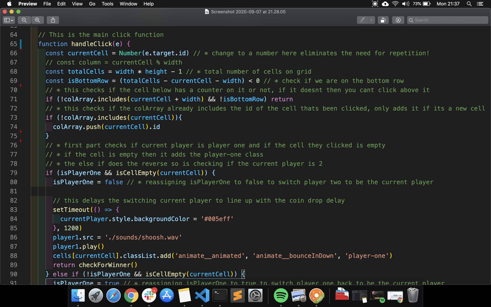
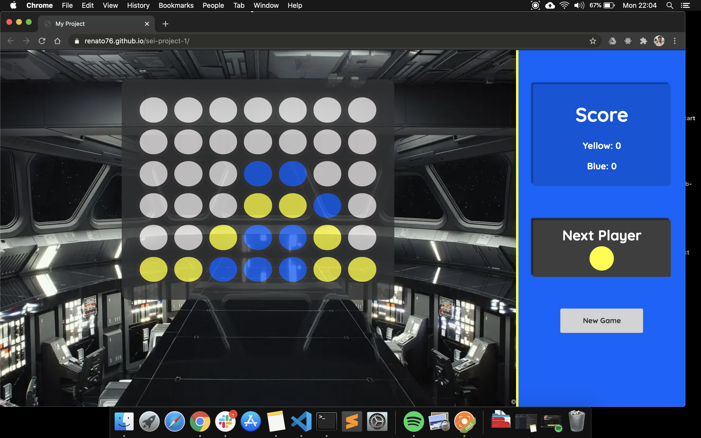

# SEI 50 Project 1 

## Goal: To create a single page, grid-based game

## Features Required: 

* 2 player mode
* Must keep scores
* Must have a win logic.
 
 

### **Timeframe**

* 7 days  
 

### **Technologies Used**

* JavaScript ES6
* HTML5 + HTML5 Audio
* CSS + CSS Animation
* GitHub  
 

### **Dev Tools**

* VS Code
* XCode
* GitHub
* Google Fonts
* Chrome Developer Tools
 
 
 

# **My Game - Connect 4**

## **Overview**

Connect Four (also known as Four Up, Plot Four, Find Four, Four in a Row, Four in a Line, Drop Four, and Gravitrips in the Soviet Union) is a two-player connection board game, in which the players choose a color and then take turns dropping colored discs into a seven-column, six-row vertically suspended grid. The pieces fall straight down, occupying the lowest available space within the column. The objective of the game is to be the first to form a horizontal, vertical, or diagonal line of four of one's own discs.

This was my first project from General Assembly's Web Development Immersive Course. It was an individual project built in a week, and was both the first proper game I had built, and my first real-world type practice with JavaScript.
 
 

## **Launch The Game**

<https://renato76.github.io/sei-project-1/>
 
 

## **Check Out The GitHub Repo**

<https://github.com/renato76/sei-project-1/settings>
 
 

## **Process**

Initially I created a 7 x 6 grid using JS for loop and CSS, and gave each div an ID from 0-41. 

I then needed to find a way to make the tokens stack from the bottom row and only be available if either bottom row or on top of another token. This was achieved using a function to check if already token there, and if statments to check lowest available cell in chosen column. 

Next stage was to make players switch on each turn, and also check for a Winner on each turn.

Then it was time to create the win / lose logic. This was achieved long handed, by writing out all the possible div id win combinations of 4 in a row, vertically, horizontally and diagonally. Total of 69 possible combinations.

I also added a logic to check if the game was a tie.

 
 

## **Challenges**
The main challenges were firstly getting player choices to stack properly on top of each other.

The other challenges were the win logic calculation and approach, and then also the function for starting a new game, whilst also keeping scores.

This final function needed to effectively reset the game by making all cells available again but keep scores intact, which was quite a challenge.
 
 

## **Bugs**

Initial bug was where one player could select the same cell as another player. This was resolved with the function that checked if array that stores all player choices dit NOT contain either of the 2 players classlists.

New bug was that when starting a new game, the JS was allowing players to stack their token on previous game's tokens which needed a bit of time to work out why this was happening.
 
 

## **Wins**

For me the switching players was a win, definitely also the creating the winning arrays and getting the JS to check for these on each player turn.

The other win was to add the effect of a bounce on each token. This was achieved with animate.css prebuilt CSS effect. 

Initially the theme was the classic blue frame with red and yellow pieces however I chose this alternative theme of star wars background which led to adding spaceship type sounds to each play and to the reset button.
 
 

 
 

## **Future Features** 

The next phase will definitely be to make this properly functional on mobile devices and tablets.